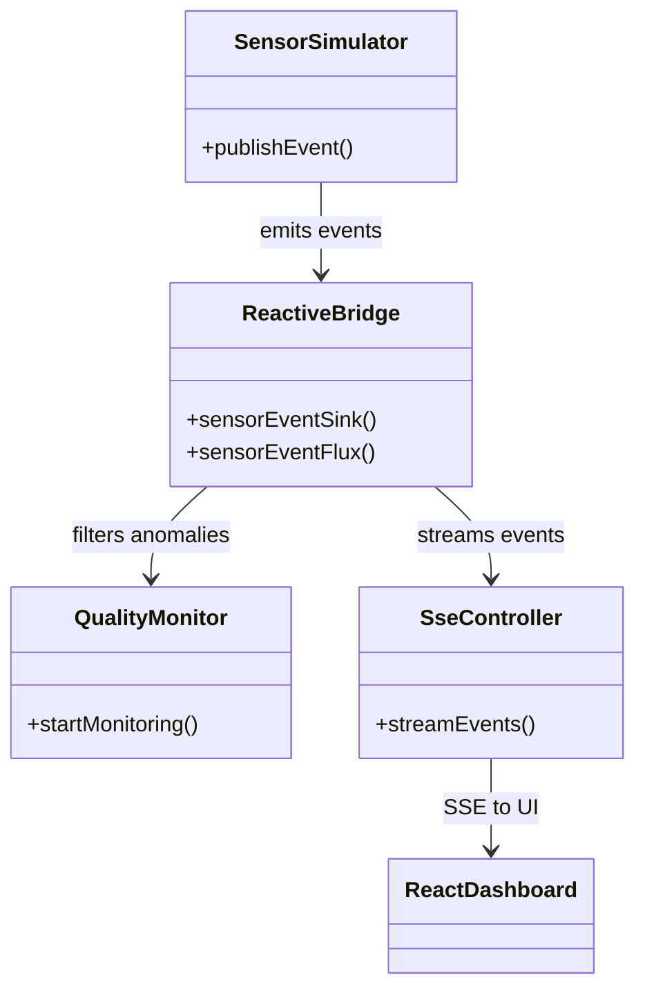

# Real‑Time Food Quality Monitoring

A modular, reactive Spring Boot application that simulates sensor data, processes it for anomalies, and exposes a real‑time dashboard.

---

## Table of Contents

1. [Overview](#overview)
2. [Architecture](#architecture)
3. [Module Breakdown](#module-breakdown)
4. [Data Flow](#data-flow)
5. [Design Decisions](#design-decisions)
6. [Getting Started](#getting-started)
7. [Container & Kubernetes](#container--kubernetes)
8. [Testing](#testing)
9. [Configuration](#configuration)
10. [Monitoring](#monitoring)

---

## Overview

This project demonstrates a real‑time monitoring demo focusing on:

- **Reactive programming** with Project Reactor
- **Logical modularity** across three modules
- **Anomaly detection** based on configurable thresholds
- **Docker & Kubernetes** deployment manifests for cloud‑native support
- **Monitoring** with Prometheus and Grafana via Spring Boot Actuator

The application generates mock sensor events (temperature & humidity), streams them reactively, filters anomalies, and serves Server‑Sent Events (SSE) to a React/Tailwind dashboard. It also exposes metrics for Prometheus scraping.

---

## Architecture



- **Sensor Simulator**: Scheduled task emits `SensorEvent` objects to a `Sinks.Many`.
- **Reactive Bridge**: Provides a multicast sink and `Flux` to decouple producer & consumer.
- **Quality Monitor**: Subscribes to the `Flux`, filters events exceeding thresholds, logs anomalies.
- **Web Layer**: SSE controller maps `SensorEvent` to `ServerSentEvent` for the frontend.
- **Monitoring**: Spring Boot Actuator exposes application metrics (including health and Prometheus format) at `/actuator`.

---

## Module Breakdown

1. **sensor-simulator**

   - Generates mock `SensorEvent` every 5 seconds
   - Uses Spring `@Scheduled` and Reactor `Sinks`

2. **quality-monitor**

   - Consumes event `Flux`
   - Filters for temperature > threshold OR humidity < threshold
   - Logs anomaly alerts via SLF4J

3. **application**
   - Configures Spring Boot application & scheduling
   - Defines `ReactiveBridge` beans: `Sinks.Many` and `Flux`
   - Exposes SSE endpoint `/events/stream`

---

## Data Flow

1. **Producer** (`MockDataGenerator`) pushes events into `sensorEventSink()`.
2. **Bridge** multiplies and buffers events via `Sinks.many().multicast().onBackpressureBuffer()`.
3. **Consumer** (`QualityMonitor`) subscribes to the sink's `Flux`, applies reactive operators (`filter`, `doOnNext`).
4. **Web API** (`SseController`) streams events to browser as SSE.
5. **Front End** React app listens, renders charts and lists in real time.

---

## Design Decisions

- **Multi‑Module Structure**: Enforces separation of concerns and clear dependencies.
- **Reactive Bridge**: In‑memory, decoupled communication without external brokers.
- **Configurable Thresholds**: Externalized in `application.yml`; supports dev/prod profiles.
- **Server-Sent Events**: Lightweight real‑time push to browser without WebSockets.
- **Docker Multi‑Stage**: Small runtime image, separate build stage.
- **Kubernetes Manifests**: Deploy with health probes, resource limits, config via env.

---

## Getting Started

Requirements:

- Java 17+
- Maven Wrapper (`./mvnw`)

Build & run locally:

```bash
./mvnw clean package -DskipTests
java -jar application/target/application-1.0.0-SNAPSHOT.jar
```

Open browser at `http://localhost:8080` (serves the React dashboard).

---

## Container & Kubernetes

Build Docker image:

```bash
docker build -t your-registry/real-time-food-quality:latest .
```

Apply Kubernetes manifests for the application:

```bash
kubectl apply -f k8s/deployment.yaml
kubectl apply -f k8s/service.yaml
```

Apply Kubernetes manifests for Prometheus and Grafana:

```bash
# Prometheus
kubectl apply -f k8s/prometheus-configmap.yaml
kubectl apply -f k8s/prometheus-deployment.yaml
kubectl apply -f k8s/prometheus-service.yaml

# Grafana (includes Prometheus datasource config)
kubectl apply -f k8s/grafana-datasources-configmap.yaml
kubectl apply -f k8s/grafana-deployment.yaml
kubectl apply -f k8s/grafana-service.yaml
```

Access Grafana via its LoadBalancer service (check `kubectl get svc grafana-service`). Prometheus scrapes metrics from the application service automatically based on the configuration in `prometheus-configmap.yaml`.

---

## Testing

Run unit tests with:

```bash
./mvnw test
```

- **Domain Tests** (`SensorEventTest`)
- **Generator Tests** (`MockDataGeneratorTest`)
- **Monitor Tests** (`QualityMonitorTest`)
- **Bridge & Controller** (`ReactiveBridgeTest`, `SseControllerTest`)

---

## Configuration

Thresholds can be adjusted in `application/src/main/resources/application.yml` or via environment:

```yaml
thresholds:
  temperature: 8.0
  humidity: 50.0
```

Actuator endpoints are configured in the same file:

```yaml
management:
  endpoints:
    web:
      exposure:
        include: "health,info,prometheus" # Expose health, info, and prometheus endpoints
  endpoint:
    health:
      show-details: always # Show full health details
```

---

## Monitoring

The application integrates with Spring Boot Actuator to expose operational information. Key endpoints include:

- `/actuator/health`: Shows application health status.
- `/actuator/info`: Displays application information.
- `/actuator/prometheus`: Provides metrics in Prometheus format.

The provided Kubernetes manifests (`k8s/`) include configurations for:

- **Prometheus**: Scrapes the `/actuator/prometheus` endpoint of the application pods.
- **Grafana**: Pre-configured with Prometheus as a data source, allowing visualization of the collected metrics. Access Grafana via its service (`grafana-service`).

---

© 2025 Real‑Time Food Quality Monitoring Demo
